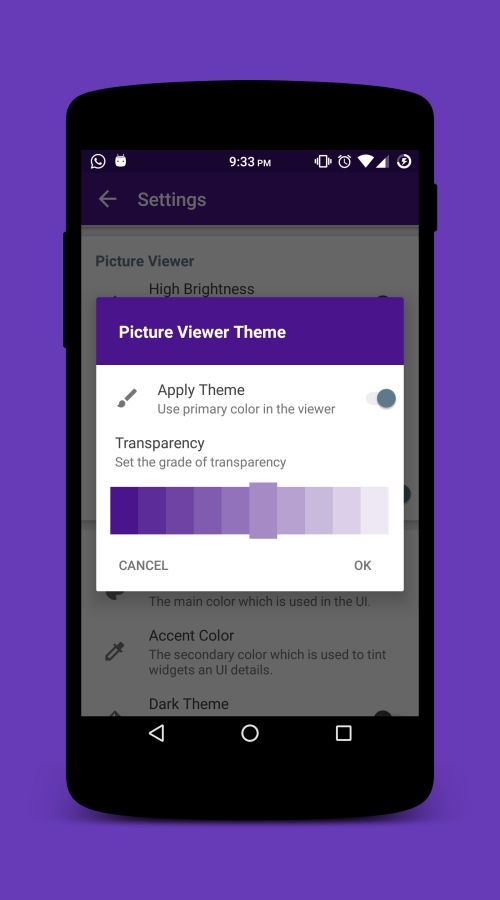

## 截图

    
    
    
    
    

#### 贡献

###### 代码 & 问题
如果你是一个开发者，你想为应用做贡献，请把这个项目交出来。

并提交一个拉请求，如果可能的话，请将它放在[开发部门]上。（https://github.com/ccyznl/LeafPic）

###### 说明
如果你能提供一个新的翻译缺少的语言或如果你想改善现有的，我们非常感谢任何建议！

该项目采用[对]（https://crowdin.com/project/leafpic），一个平台，允许任何人有助于翻译程序

###### 证书
leafpic是GNU公共许可证许可的[ GNU v3 Public License]下V3（https://github.com/ccyznl/LeafPic）。

除了GNU V3公共许可证所规定的条款之外，我们还要求您使用这个存储库中的任何代码，向我们发送一条消息让我们知道。